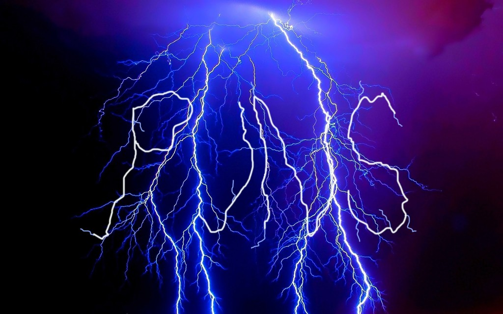

Let me set the tone by spitting a blunt truth. People who enjoy puns are better than people who don’t… and yet, like someone buying food at an airport, puns tend to get a bad rap (1-D, 1º, L1: lateral manipulation, slant reference).

The reason puns are so misunderstood is because they lack the key to any good joke: a clearly defined toolset that allows audiences to meaningfully scrutinize them with rigorous objective analysis. This changes now.

Below you will find a framework for pun evaluation. It consists of three core concepts:

- **Dimensionality (D)**, reflecting the complexity of a pun.
- **Degree (º)**, measuring the number of isolated components of a pun.
- **Level (L)**, expressing the number of linguistic facets used to represent all angles of a pun.

## Pun Dimensionality
> It’s the night before the big game and the star pitcher is at his locker when he hears clucking coming from the equipment room. Intrigued, he walks over, turns on the light, and immediately recoils: the floor is teeming with chickens! They’ve been there all day, and equipment is completely covered in chicken poop. On the wall hangs the emblem of the opposing team. He runs to the hallway to catch the attention of a patrolling umpire. The umpire comes in, looks at the shower room, and shouts “Foul Play!!!”
> 
> – “Chickenball”, a 3-Dimensional Pun by Paul Schultz 

The dimensionality of a pun is the number of meaningful interpretations, minus one. If a pun has two possible interpretations, it is a one-dimensional pun. Three interpretations? two-dimensional. TEN interpretations? That’s obviously impossible.

For example, the boring phrase “I solved the garbage problem” is a zero-dimentional (0-D) pun. That is to say it is not a pun at all. Embarrassing.

Meanwhile, the phrase “I salved the garbage problem” is a 1-D pun, because “salve” is an old way of saying “salvage!” In this case the speaker didn’t just solve the garbage problem, but they did so by wandering around collecting it for meaningful reuse. Amazing!

You could add yet another layer by saying “I salved the makeup department’s garbage problem,” which uses the whole “ointment” spin to make it a 2-D pun.

This feels rewording already.

In physics dimensionality reflects complexity, with each added dimension opening powerful new ways to navigate a concept or space. This means that physics is really just the science of…

(Puns are a great way to lighten the mood.)

## Pun Degree
> Transporting young gulls across a staid lion for immoral porpoises.
> 
> – [“So this guy”](https://www.youtube.com/watch?v=L1CNRF-5ckU), a 3rd Degree Pun by Peter Schickele

In the United States, the seriousness of certain injuries (broken bones, burns, Kevin Bacon, etc.) can be measured in terms of degree. The higher the degree, the more intense the affliction.

A pun’s degree is defined as the number of individual sub-puns contained in the joke. It reflects the number of “jokes” that are being coherently strung together to form a single masterpiece. Finally a situation where quality and quantity are one and the same!

Let's consider the following pun and see what we can do to increase its degree: “When stuck on the beach you can always eat a sandwich.” This is a delicious one degree (1º) pun because beaches have sand, but also people eat sandwiches.

We can do better by shifting the scene and adding some more descriptive text, resulting in a 2º pun: “When playing golf if you’re stuck in a bunker you can always eat a sandwich, but be careful: the bread’s crust might be coarse.”
<ul>
  <li><strong>Pun 1</strong>: Bunkers are a type of hazard in golf, often containing ample amounts of sand.</li>
  <li><strong>Pun 2</strong>: You play golf on a golf course, the texture of bread crust can be coarse.</li>
</ul>

Time to go all in by playing up the golf setting and taking a swing at a 3º pun: “When playing golf, if you’re stuck in a bunker you can always eat a sandwich, but it might be hazardous: the bread’s crust will be coarse!”
<ul>
  <li><strong>Pun 3</strong>: bunkers are a type of golf hazard, coarse bread can be really tough on your gums, man.</li>
</ul>
Clearly this could go on forever, so why stop?

“War is hell. I remember one time when ten of us were holed up in one bunker on an abandoned country club and I decided to eat a sandwich, it was sub par because the bread’s crust was coarse; I wasn’t gunning to take another bite but my commander wouldn’t lettuce fight on an empty stomach.”

<em>Note: the dimensionality of a compound pun is the maximum dimensionality of the individual sub puns.</em>

## Pun Level
<blockquote>A French company was designing the look of their product’s chat system. After days of deliberation it became obvious that there is more than one way to skin a chat.  
- “Skin a Chat”, a Level 2 pun by Todd Eichel
</blockquote>

When someone says something smart and you don’t understand them, you quietly sigh, shake your head, and say “I’m obviously not on your level." Take the inverse of everything in the previous sentence and it becomes directly applicable to puns.

A pun’s level is the number of unique linguistic facets needed to communicate the full complexity of the pun, minus one. Calculating a pun’s level takes practice. It involves going through each facet type and determining whether or not it has been invoked.

The following facets can contribute to a pun’s level:

<ul>
  <li><u><strong>Hidden structure</strong></u> — inserting or removing components of the sentence results in a new relevant meaning. (e.g. “that amazing gargoyle (is made of) rocks”)</li>
  <li><u><strong>Lateral manipulations</strong></u> — modifying key words to form other words through the shifting / replacement of letters or sounds. This includes puns grounded in rhymes and typos. (e.g. “I don’t think it’s bare that public nudity is a crime.”)</li>
  <li><u><strong>Portmanteaus</strong></u> — forming (or inventing) a new word using two or more relevant words (e.g. “<a href="https://github.com/BadIdeaFactory/geohash-notes" target="_blank">geochordinates</a> let you translate a location to music.”)</li>
  <li><u><strong>Language modulations</strong></u> — invoking a relevant definition of a word in another language. (e.g. “hola at me”)</li>
  <li><u><strong>Simple heterograph</strong></u> — implying two distinct words that sound the same, where both have relevant meanings. (e.g. “I can’t tell weather or not it is raining.”)</li>
  <li><u><strong>Dual definitions</strong></u> — using two uniquely relevant meanings of the same word. (e.g. “that NASCAR driver really raced out of here”)</li>
  <li><u><strong>Contextual binding</strong></u> — unnecessarily choosing a word based on a contextual topic or domain that has been established outside of the pun itself. (e.g. most of the times when someone says “no pun intended”)</li>
  <li><u><strong>Slant references</strong></u> — artificially incorporating a common or locally known phrase (colloquialism, idiomatic, etc.) into a sentence. (e.g. “I know you hate accessories, but don’t kill the messenger bag”)</li>
</ul>

Many puns are level zero. Rightfully so.

<em>Note: the level of a compound pun is equal to the total number of unique facets used across all of its sub puns, minus one</em>

## Additional Concepts

<ul>
  <li><u><strong>Stable / Unstable Facets</strong></u> — although all facets can stand on their own, some are more common among higher level puns. Stable facets are more likely to exist within a Level 0 pun, while unstable facets are more likely to require another facet to form a pun.</li>
  <li><u><strong>Imaginary Puns</strong></u> — imaginary puns require a change to reality itself (excluding language) in order to make sense. They are measured in distance, with distance being the smallest number of required changes. (e.g. if your coworker were to say “you must have a lot of brass to say something so bold” it would probably not be a pun. But if reality were different, and you played french horn, it would be a (1-D, 1º, L0) pun).</li>
  <li><u><strong>Unpuns</strong></u> — an unpun is a phrase that feels like it should be a pun, but has no valid facets. These are also known as “Level -1 Puns.” (for example: “We all know that PUN stands for Play UN words”)</li>
  <li><u><strong>Pun Space</strong></u>: a pun space is the graphical representation of parsed phrases (vertices), interconnected by linguistic facets (edges) that perform translation. Pun spaces make it possible to mathematically describe the way a pun fits into its neighboring tapestry of language.</li>
</ul>

## Practical Applications / Concluding Thoughts

The Puntitled Framework is being freely offered to the world for the betterment of humanity.  It is my hope that you will take these concepts and apply them for social and professional gain.  As a consumer you are now able to deterministically quantify the puns you are exposed to.  In the age of information overload this empowers you to make better decisions about where to get your information and who to continue to publicly associate with.  Most importantly, as a pun maker you can use the structure provided by this framework to dramatically increase the quality, complexity, and impact of your puns.

Aside from these obvious personal applications, this framework has the potential to redefine most industries through the optimization and automated discovery of puns. The ideas introduced here will inject new life into the fields of social computing, natural language processing, political debate, robotics, journalism, and probably even international diplomacy.

Now go spread the word and make some puns.

*This post was originally published on [slifty.com](https://slifty.com/2016/03/a-puntitled-framework-for-evaluating-the-quality-of-puns/)*
