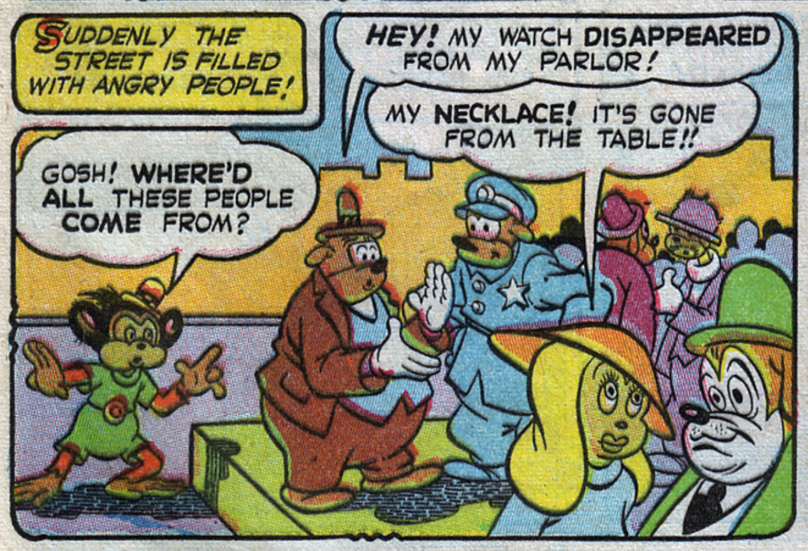
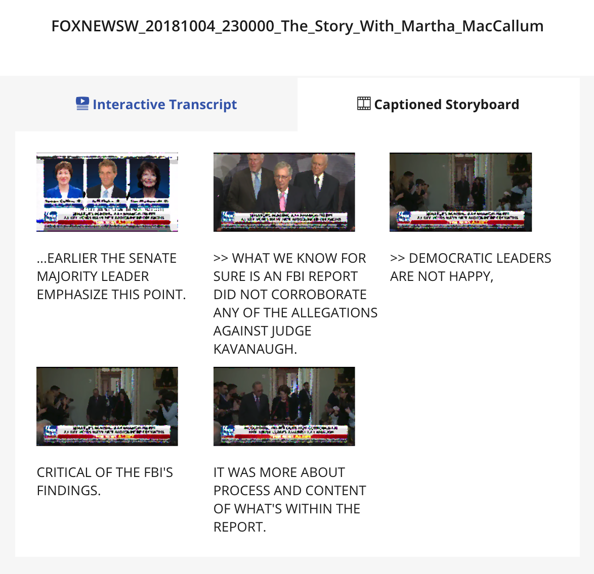

> For me context is the key – from that comes the understanding of everything.
— Kenneth Noland

# Context is the Key

Context is everything! And yet many of us have trouble establishing context, especially on the Internet, where often none is explicitly given.

For many social media platforms such as Twitter and Facebook are becoming sources of news, playing an increasing role in forming people’s opinions. Opinions that are often taken to the voting booths.

As the average attention span dwindles, the currency of social media are those small packets of dopamine-releasing information -  those hits come in the form of 280 character chunks of text, photos, animated gifs or video clips.

Video clips are becoming an increasingly popular way of transmitting byte-sized information suiting people’s personal and internet bandwidth.

In 2017 [Dan Schultz](https://twitter.com/slifty) was awarded a Prototype Grant from the Knight-Foundation to pursue an idea he had while working for the TV News Team at the Internet Archive. Since we had some experience of audio and video on the web, Dan brought in [myself](https://twitter.com/maboa) and [Laurian Gridinoc](https://twitter.com/gridinoc) to build out a prototype of [The Glorious Contextubot](https://contextubot.com).

## So what’s the problem?

To help explain let's break things into two main issues. The first issue is that video is still seen as trustworthy, widely interpreted as ‘real’ by the people who consume it. Secondly - video broadcast out of context can be used to tell a different story than the one you’d get by seeing it in context.

So in very few words we could define our mission as one of establishing authenticity and context.

## Our Approach

Enter Internet Archive, a non-profit perhaps best known for the WayBack Machine (which gives people access to an archive of a good portion of the world’s websites). 'The Archive' is also home to a large archive of TV News content. It made sense then to partner and use Internet Archive as one of our trusted sources and context providers.

But first we had so solve the other issue - establishing context! Some of you may have seen Google’s reverse image search, where by submitting an image you can find other images similar to it, thereby making it possible to find out what type of damn snake that is anyway. Searching for the original video from a small snippet involves similar challenges. Thankfully we can use the audio track and a technique known as Audio Fingerprinting.

## Tell Me more about Audio Fingerprinting

The basic premise behind audio fingerprinting is that just like its physical counterpart (erm finger fingerprinting), any given piece of audio can be represented with a unique pattern.

We evaluated two key pieces of technology to facilitate the fingerprinting and search:

[Audfprint](https://github.com/dpwe/audfprint) - Landmark-based audio fingerprinting written in Python.

[Dejavu](https://github.com/worldveil/dejavu) - Audio fingerprinting and recognition algorithm written in Python.

Broadly speaking, we establish a fingerprint from a sequence of hashes which we then match against hashes of the TV News Archive material. [More info is available from the authors of Dejavu for those interested](http://willdrevo.com/fingerprinting-and-audio-recognition-with-python/).

Each of these libraries would need modification for our purposes. Audfprint at scale would randomly drop entries (in order to keep the size of the database from ballooning) - this can be addressed to some extent by sharding (or storing data into a number of databases) and/or modifying the settings. More significantly the way that Audfprint stored fingerprint hashes led to a truncation of temporal values, leading to a loss of accuracy in reporting where in the source material the submitted clip occurred - acceptable when you just want to identify the source material, but not in our case, when you want to identify where in the original material the clip occurred.

We also felt that hooking things up to a database could make things more efficient - MySQL in our case.

Dejavu uses MySQL, however Dejavu stops once it finds a match and we wanted to bring back all matches of a specific clip.

In the end we decided to use Audfprint and modified it so that it no longer dropped entries and added a MySQL backend to accommodate a more accurate temporal look-up. This worked fairly well but there’s room for improved performance.

Of course thinking we had eliminated certain bottlenecks we soon discovered new bottlenecks, such memory data storage limits, where we wanted to analyse it quickly, and the network delay in using a MySQL server. However experimenting with our modified version of Audfprint we concluded that this would require further refinement to scale properly and allow more reasonable hosting costs, which led us to experiment with a serverless model and [Amazon Lambda](https://aws.amazon.com/lambda/) but that's another story.

## Engagement and Future Plans

As small clips are usually more digestible than the news piece they are extracted from, one of our objectives was to “make the big picture as engaging as the viral one”. In contrast larger video clips require more time and patience to consume. A possible solution was to convert video to a more immediate medium.

The thing with audiovisual media is that it’s notorious difficult for us humans to scan. Transcripts can help people scan the spoken content of videos, but even better - Interactive Transcripts also facilitate intuitive forms of navigation by attaching the transcript to time points in the video. Since most of Internet Archive’s TV News archive also include Closed Captions we could create an Interactive Transcript to accompany the discovered video.

Interactive Transcripts also enable an important viral mechanism, in that we can  select small clips by selecting text and opting to share the text and associated media on various Social Media platforms.

Interactive Transcripts went some way to address the accessibility of pieces of TV News, and to an extent the virality. But we wanted to take things further.

An often overlooked and yet extremely compelling format is the comic. Comics have been for around 100 years now and often not taken seriously as a media format, however the combination of stylised imagery and text has proven to be a very engaging one.

Since we have access to captions, other metadata and of course the video - we have the base ingredients required to generate a comic. Not to trivialise a medium that is often very thoughtfully put together, the idea just being to approximate it and capture some of the immediacy of the format.

To deconstruct slightly the established comic format. Comics are usually made up of a number of panes, dialog represented in speech-bubbles and supporting scene-setting text usually presented in a square box in a corner.

The vision then is to create a comic representation good enough to get people engaged. We could potentially identify speakers faces and position speech bubbles appropriately. Using meta-data such as time and location we could populate the scene-setting text. Online, ‘strips’ could be easily shared and interacted with (imagine hovering over a pane only to see it come alive with the actual piece of video it represented?).

Theoretically this could also work as printed media, we imagined people printing out the strips and leaving them in various public spaces - complete with a handy URL or QR code back to the source! Using Augmented Reality (AR) we could also bring the physical version to life, via an app and a phone screen.

Although we many of the above ideas were out of scope, I’m happy to say that we managed to ship our first version of ‘Comic View’ that took frames from the video at the start of a given caption time, applied a visual filter and added the caption to the bottom of the frame.

We had a lot of fun experimenting with face-detection and scene-detection, and looked at some fantastic comic filters.

## Looking Ahead

Having played with technology that [successfully grafted Nicholas Cage’s face on to a young Dan Schultz video](), we know that the era of realistic fake video is just around the corner. It follows then, that a service like The Glorious Contextubot is going to be increasingly important. You might even mandate that every social media clip have a Contextubot link next to it!

## Wrapping Up

So that’s The Glorious Contextubot v.0.0.1. Prototype. In summary we’ve achieved a better understanding of a technically complicated problem space, ran some user testing, applied some creative ideas to the issue of engagement, created a proof of concept and plotted a course for further work.

You can find our presentation here <link>

Robot photo credit [Mark Wilson](https://www.flickr.com/photos/funnypolynomial/)
