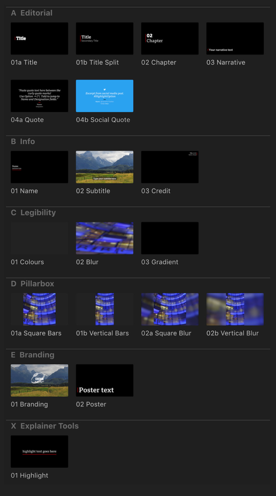
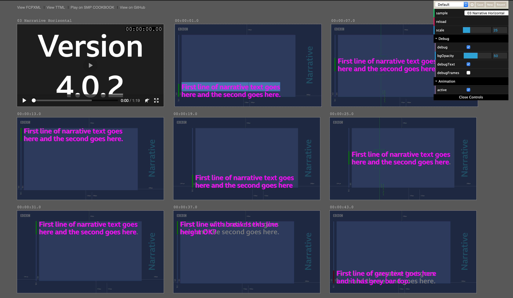

## Your Mission, should you choose to accept it…

In the Summer of 2018 we responded to a tender request from the BBC looking to prototype a system that could make Narrative Text accessible to screen reader users.

Similar to subtitles or captions, Narrative Text displays a fancy styled text description over the video screen. It augments the narrative by setting the scene or describing something happening in the video. Unlike subtitles Narrative Text is usually styled in line with the organisational branding guidelines.

The fanciness part is key. Fancy, because of the strong visual styling and animation, Narrative Text is usually ‘burned in’ to videos, thereby making it invisible to screen readers when used in the context of the web — which is clearly a Bad Idea™!

The BBC had just undertaken a (very fancy) organisation-wide restyling of their Narrative Text, and BBC News Labs were keen to evaluate making it accessible. Enter Bad Idea Factory. The only problem was that this was a good idea!

But why then would Bad Idea Factory work on this? This was a problem that was virtually impossible to solve. I mean elements of it were possible using workarounds, but to make the actual styled text accessible in such a way that it could be dynamically generated, screen-readable and of acceptable stylistic quality, and all of this using web technology was virtually impossible.

To create a complete workflow from Final Cut Pro X (the BBC’s editing suite of choice) to web was clearly delusional and doomed to failure. So that is what we set to work on.

## Clearly Delusional

Our broad approach was to take the Final Cut Pro XML (FCPXML) generated from the templates used to create the current burned-in Narrative Text and transform it into TTML, then add in all the fancy bits with CSS and JavaScript.

For reasons best left to engineers with sado-masochistic tendencies, it seemed fitting to use an arcane technology known as XSLT (eXtensible Stylesheet Language Transformations). XSLT was initially created by the W3C to transform XML into XHTML but is now more commonly used for more general B2B data exchange. Perfect!

To keep things interesting we decided to use XSLT 1.0 — a standard finalised in the nineties. We stopped short of using the XSLT processor that is built into most browsers due to varying implementations, limitations around calling external resources and dubious continued support.

Using XSLT 3.0 or even 2.0 would have meant less development pain, however 1.0 is better supported on a number of platforms, so we opted for flexibility and a certain old school vibe, oh and free implementations.

Our timing was great as the BBC were refreshing their visual identity and had commissioned a new font BBC Reith (https://www.bbc.co.uk/gel/articles/introducing-bbc-reith) which they had already incorporated into some spiffy new narrative text designs and animations.

I’m glad I mentioned animation, I had almost forgotten about that particular pain point — we’ll come to that in a bit. But first let’s breakdown our monumental task into smaller steps.

There were three of us working under Bad Idea Factory umbrella on this project, [Laurian Gridinoc](https://twitter.com/gridinoc/) — overengineer extraordinaire, [Piotr Fedorczyk](https://twitter.com/presentday) — designer, developer, perfectionist, unicorn — call him what you want but make sure you use a decent font and get the line-spacing just right! And me — the lowly project manager who gets to deal with all the boring stuff — the writing of this blog post being the highlight of the entire contract for me. The BBC News Labs side was headed up by [Pietro Passerelli](https://pietropassarelli.com/) — a fellow [OpenNews](https://www.opennews.org/what/fellowships/) fellow along with me and Laurian and a keen advocate of timed-text technology and organiser of TextAV meetups.

So now that the band was back together we were off to the races (to mix metaphors). Architecturally we decided to attend to the text generation separately from the text styling and animation. Since different people were working on each of these tasks we decided to create a type of sandbox where the designer/developer (desigineloper?) could come in and add styles using CSS, untroubled by the various machinations that occurred to generate and layout the unstyled text. Of course no system is born perfect, so there was a certain to and fro-ing as it became clear that layout would need to be tweaked in order for styling to be reasonably applied. Which would have been fine if it wasn’t for all the different permutations and our collective somewhat obsessive nature. *Stares at Laurian.*

Let’s talk about those permutations for a moment. The BBC have to cater for a number of devices — chiefly mobile, tablet and desktop — and so the narrative text needs to be positioned accordingly for each of those targets. Adding to this the various different positions and combinations of styled text, we ended up having to style 19 templates — each with slightly different CSS and markup.

It should be noted that it was extremely important that the web-rendered Narrative Text was faithful to the burned-in versions if it was going to be seen as a viable alternative. No pressure then!

Luckily we could take advantage of open source libraries to help us along our way, imscJS was one of these libraries — [IMSC](https://developer.mozilla.org/en-US/docs/Related/IMSC) stands for Internet Media Subtitles and Captions which is a profile of [TTML 2](https://www.w3.org/TR/ttml2/) — essentially what imscJS provides is a way to render TTML to HTML.

It’s fairly important to know that IMSC restricts some of the TTML features, for example there is no support for overlapping regions.

Those of you paying attention will remember that we are converting the XML generated by Final Cut Pro X (FCPX) into TTML, it’s worth attaching a small note to this — if plugins have been used to create the template, the FCPXML can contain references to these effects, in our case Apple Motion effects. Referenced from within the XML — these manifest themselves as a link to a location on the user’s local environment — which makes it super-important that we have the same setup as the user, and actually that all users have the same setup (as far as FCP plugins are concerned).

Apple Motion effects files contain information related to the positioning, font size, colours and default values for all of the above.

## Measure Twice, Cut Once

The requirement to animate text on a line by line basis meant we needed to figure out a way to split text for all the various weird and wonderful permutations.

How do we know where to split the line? Well, short of submitting the original FCP versions to an Optical Character Recognition algorithm we’ll need to measure.

In our case measuring involves creating the text in a container which is handily positioned off to the left of the screen. First we insert one word into this offscreen container to establish the height, at which point we proceeded to add the words back in until the height changes. When the height changes we know that the text has overflowed and so the words that make up the first line. We repeat the exercise with all text content until we have our line breaks.

Of course whenever the media player is resized we need to recalculate the box that contained the text, as media aspect ratio was known (regular 16:9, square 1:1 and vertical 9:16), if (say) a user chooses full screen view and the screen does not match the aspect ratio, the actual media will have black bars — that black bar rendering is internal to the video player, so we had to allow for it to scale the text properly and position it correctly.

It‘s worth noting that although we tried to stay faithful to the original FCP created narrative text, occasionally we would hit upon a case where lines broke at different points to the original — this was usually due to a subtle kerning difference present in FCP type which was unfortunately not recreatable on the web.

## Wheels Within Wheels

As I touched on earlier we ended up creating a system (within a system), intended to promote and ease workflow around the separation of style, content and to a lesser extent structure. This sandbox afforded our designer a certain amount of freedom and autonomy and had the additional benefit of being a useful acceptance testing tool.

We called this the Playground, but thinking back to my childhood we missed a trick by not calling it [Play School](https://en.wikipedia.org/wiki/Play_School_(British_TV_series)).

## Safety Nets

Clearly only the foolish would attempt such a feat without some kind of safety net. Our safety net was to use the offscreen trick for screen-readable narrative text — instead of the on screen text. If this sounds like a cop-out — that's because it is. We wanted to show that reading the on-screen text was in theory possible, which we did but wanted too leave the other option on the table as the most important thing was the accessibility part — if for whatever reason the on-screen text didn‘t seem accurate enough or exhibited other issues, then the BBC could still provide accessible narrative text using the off-screen method.

## Timing

As it turned out there was another issue that we hadn't forseen — timings. Specifically the fact that the text disappeared from the screen before having been fully read. This caused some of the screen-readers we tried to stop reading, even when this wasn‘t the case when next piece of text appeared on screen it would interrupt the previous. Queuing is possible in theory although you‘d have to interleave the narrative text with captions and you‘d lose the sense of pace.

We tried to address the issue by not destroying the text immediately after it had disappeared from the screen, leaving time for the screenreader to finish. We could also adjust the start time, adding text to the screen before fading it in. We tested at default read speeds and generally those measure helped, however some may mitigate this issue somewhat by setting a faster reading speed.

The recommendation I would personally make for general audio and video accessibility is to allow playback rate to be adjusted. This is a standard method in all browsers now and so is generally straightforward to implement, but is sadly a piece of functionality that many media players lack.

## What we Learned

We knew this was a difficult project from the start and that's what made it a Bad Idea (TM) but all told, we were very happy with the outcome. There was scope for more fine tuning, but we managed to demonstrate that we could make Narrative Text accessible and even provided tools to create that text.

We learned that there are a number of screen-readers — their compatibility varying depending on operating system and browser.

We learned that it‘s almost impossible to keep fidelity with Final Cut Pro X‘s text rendering as you at the mercy of their rending engine which it turns out is subtly different to that of browsers, especially when it comes to kerning.

Finally we learned that it‘s OK to use old and very unfashionable technology (such as XSLT) if it solves the problem — in other words there are advantages to being old (school).

By [Mark Boas](https://twitter.com/maboa)
