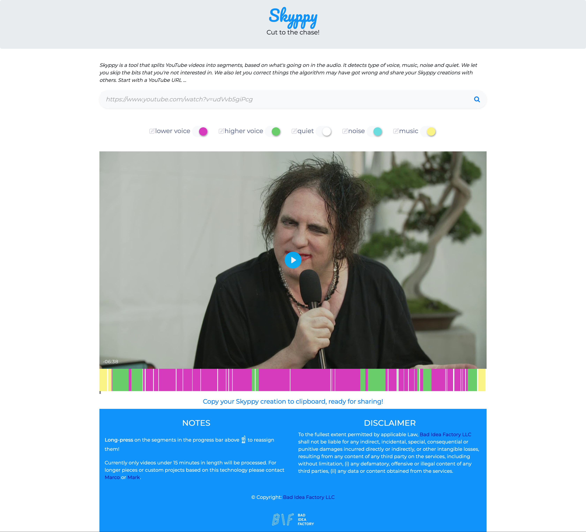

## Skyppy

When I discovered [inaSpeechSegmenter](https://github.com/ina-foss/inaSpeechSegmenter) from [Institut National de l'Audiovisuel](https://www.ina.fr/)
I knew that I had to base our next Bad Idea™ on it. INA’s Speech Segmenter segments audio into music, noise and speaker gender. Turns out that last bit needs to be approached very carefully.

Like all side projects I work on, they tend to last years (if not decades). I think we’re into our 3rd year with Skyppy. It’s been a slow, slow burner. 

So what’s the idea? The idea is to segment or split parts of an audio file (or YouTube video in our case), based on specific criteria – silence, voice type, music and  noise. Maybe you don’t want to listen to that intro music or the applause and just consume the parts that matter. Or maybe you just want a handy visual guide of who is doing all the speaking.

I started working on this with my friend Marco, who handled all the back-end stuff, while I concentrated on the front-end and pretty early on in the development process, we had a demo… which of course [I tweeted about.](
https://twitter.com/maboa/status/1220649076301189122)

Always good to get feedback early and we did. Now there’s a big issue with this demo – can you spot it? We used the default settings of the speech segmentation algorithm which divides things into noise, silence, music, male and female. See the issue yet? Yup – it’s the gender catagorisation. 

Two issues here, firstly – it‘s overly simplistic to split gender into male and female, and secondly how can you differentiate a so-called female voice from a male one? The second issue is a classic problem in the field of Artificial Intelligence – your algorithm is only as good as the data you trained it on. And depending on how you train it, you can introduce biases. In this case if the people classifying the training data believe that there are only two genders, that’s how they will categorise and train the algorithm. 

At the time of the tweet, we were reflecting the categories which the algorithm uses to tag data, in our first iteration. But we soon realised that this was not a good representation, to say the least. At the same time we understood the value of (for example) evaluating how much men talk compared to women, so in the latest UI we replaced “female” and “male” with “higher voice” and “lower voice”, respectively. Importantly these categories can be easily relabelled by the user so if they establish the gender of the people talking, they can label it as any gender they like.

For demo purposes I used a Robert Smith (I’m a bit of a fan) being interviewed after a concert in Japan and just removed his voice, this had a comical effect as his mannerisms were left in which looked like non verbal responses to the questions. I’d like to repeat (as I did on Twitter), that was not meant as a slight, I think Robert is a wonderful person. [You can check this out in the latest version here!](https://skyppy.tv/?#v=udVvb5giPcg&s=hqnm)

## Doing things on the Side

I used to do more development and I miss it, I also miss the simplicity of developing apps in vanilla JavaScript – eschewing complicated build systems and hot reloading for a more “old school” mode of development. I used to write every part of the application including the UI. With a side project you can do all of this without worrying about your own limitations.

Although one limitation I did have was with the backend. Most AI/ML based systems are written in Python and I have limited experience of Python, so I asked my good friend and neighbour (we live in the same town at least) to give me a hand, since he’s a Pythonista (I think that’s what you call them). Python aside, Marco knows a fair bit about various cloud platforms and how to package things up to make them easily deployable and scalable. And besides, when you commit to something with somebody else, you can motivate each other to keep going (turns out this is super important for us).

## Slow Code

I live in Italy which gave birth to the Slow Food Movement, and Skyppy is a classic example of something you could call the Slow CodeMovement. Not code that runs slow, but a slower process of writing code that lets you actually enjoy it, without time pressure. Working on Skyppy for me, was a way to relax and an excuse to socialise. Nevertheless after three years, I’m happy to say we’re ready to release the first version.

## Technical Considerations

Machine learning algorithms are usually processor intensive. In other words – the cost of running them can become significant, especially in the cloud. So we soon realised that if we were going to put a demo online, we’d have to restrict the amount of content people could submit, somehow. We’re not at this stage yet, so we’ve not quite decided how to do this.

As a way for people to use the full functionality of the application without limits, we decided to package stuff up in a Docker container. The idea being that we reduce the friction for people wishing to run the web app locally.

In an effort to keep things simple we wanted to try and avoid using a database, but we did want to store the results of the segmentation AND importantly, allow people to share their results. I personally love the idea of storing all state on the URL, which people can then share with others, this works fine with data such as YouTube id, the state of the segment switches, their labels, even which labels and segments were overridden and what with. I mean, we could also serialise the JSON, shove that into the URL and I think most browsers would cope. But it would be hard to fit that URL into a Tweet (for example). Hmmm, I’m still thinking about this because it would be such a Bad Idea ™ – but sharing is caring and I’m not sure a URL shortener would cope.

## Databases. Oh no!

Although maybe we could use the filesystem instead of a database. I mean it’s just a bit of JSON, we should be fine. What could go wrong? Quite a lot, as it happens. 

Not least that to keep costs manageable we’re taking advantage of the AWS Lambda compute service, which is somewhat ephemeral, so those JSON files could get lost unless we implemented some type of synchronisation and possibly a type of file locking. So that’s why databases were invented. Oh well. Let’s consider that particular exercise in minimalism over. 

If we must, let’s talk about databases for a minute – when running things locally to avoid unnecessary dependencies we use SQLite (which is effectively just local file storage) whereas on the server we use MySQL which gives us useful things like authentication and concurrency. This is also available in the Dockerised version. The type and format of the data is the same however – it’s just the JSON produced by the inaSpeechSegmenter algorithm stored under the a key using the YouTube id (and a few usage stats to boot – no IPs obvs). Why are you using a relational database you may ask – well, it was simpler to orchestrate and works fine for our needs. You’d think that two databases would be enough, but side-projects are all about exploring, especially ways to keep hosting prices down. We like the look of [Supabase](https://supabase.com/)’s free tier for these purposes. Superbase is an open source Firebase alternative that allows you to use a Postgres database while looking after the scalability aspect.

## Economics

For this project we had a budget of $300. Unfortunately I think we have blown through this already by leaving a certain test instance of AWS running.

As we touched upon above, we can save money by using Supabase’s free tier, but how do we get the other aspects of hosting on the cheap or even free for a limited period? We’ve already optimised for cost by using docker containers that spin up only when needed. But where to host those docker containers?

We settled on Google Cloud Run as they give you $300 of credit for 90 days. We figured we’d work out what to do after 90 days when we got to it. But we could also run out of credit before the 90 days were out. It’s notoriously difficult to mitigate high traffic on cloud-based accounts, with any of the main providers. You can set notifications for when you hit an arbitrary spending threshold, but you cannot automatically limit it. Not easily at least. Although we are not expecting the site to go viral, it would be a Bad Idea ™  not to be prepared for the eventuality.

With Google Cloud Run we only need to spin up a machine when needed. Luckily Google allows us to limit the number of virtual machines we run contemporarily. With these limits in place we can feel fairly confident that we won’t incur eye-watering costs.

The other restriction we have is that we only accept videos of length 15 minutes or under.

## Performance

For economical reasons we really want to avoid the server being always on, but we also want it to scale if required, for these reasons we decided to use Google Cloud Run with a dockerised version of our system. This affects performance slightly as they are subject to a cold start and wind down if no new requests are received in a set time limit. 

The biggest boon in performance for us was when we discovered [YT-DLP](https://github.com/yt-dlp/yt-dlp) as a drop in replacement for [Youtube-DL](
https://github.com/ytdl-org/youtube-dl). The difference is that it’s much faster to download videos. This improved the end to end process of segmenting a YouTube video substantially. So much so that our psychedelic colour changing loading bar was no longer required to keep people’s attention.

Finally to negate half of the good reasons to use Google Cloud Run we decided to avoid cold starts (which admittedly take a while) by scheduling a job to hit the site every 5 minutes – a fantastically Bad Idea ™.

## Stats

We don’t store any identifying data such as IP addresses, but we are curious about how Skyppy is used and so we keep stats on…

- Total number of times the front page has been visited
- Total number of videos submitted
- Number of times are particular video has been viewed within the platform

We’re confident that we’re not breaking any GDPR rules so we’ve made [the stats page](https://skyppy.tv/pages/stats) public.

## Test Coverage

Although we have plans to add client-side tests, these have not yet been created. We do have server-side tests though, using PyTest. It would be optimistic to say that we’ve achieved 89% coverage with these tests, but hey, we’re optimistic people.

## Developer Experience

As Skyppy has a number of moving parts split between client and server, we found it easiest to encapsulate this all in a Docker container. This also helps make the deployment process more trivial. The slight downside is that it’s not always easy to get that seamless hot-reloadable developer experience. And on a Mac at least I need to restart the docker instance after every change. It also takes a while to build the very first time you run it.

It’s also possible to affect the Docker file directly within VSCode, meaning that we don’t have to restart after every change.

In an attempt to provide a better experience we experimented with a version based on the Python package and dependency management tool known as [Poetry](https://python-poetry.org/) Although this seems to work fine on Linux and Windows we had issues on MacOS. Your mileage may vary though – more details can be found in the documentation.

We also experimented with [Codespaces](https://github.com/features/codespaces) which allows us to have a cloud based development environment that you can edit using VSCode or online.

## Conclusion

Like all good side projects, Skyppy has been a lot of fun to work on. There have been periods when we haven’t had time to dedicate to it, but more recently we have been getting together one morning a week to work on the project together. Without time pressure we’ve seen that what seemed like a small project can take over three years to complete, but we’ve done a lot of experimenting in that time – a luxury resulting from lack of time pressure. Of course there is always a risk that you won’t fin
